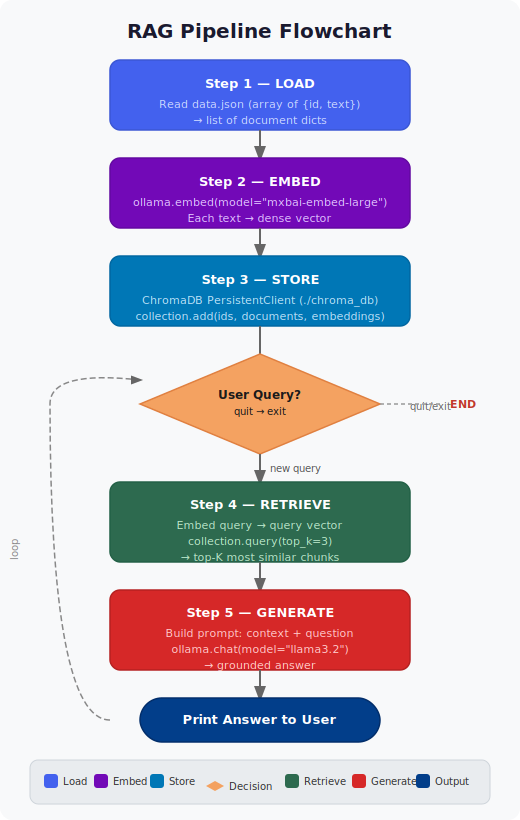

# Learn RAG with Ollama

A minimal, hands-on project to understand **Retrieval-Augmented Generation (RAG)**.

## Pipeline Flowchart



## What is RAG?

LLMs are powerful, but they only know what was in their training data. RAG solves this
by giving the model **your own data** at query time:

**Without RAG:** "What is TechFlow's return policy?" → LLM has no idea, makes something up.

**With RAG:** The same question → system finds the relevant document from your JSON,
passes it to the LLM, and you get an accurate, grounded answer.

## Key Concepts

| Concept | What it means |
|---|---|
| **Embedding** | Turning text into a vector (list of numbers) that captures its meaning. Similar texts have similar vectors. |
| **Vector Database** | A database optimized for storing embeddings and finding the closest matches (ChromaDB in our case). |
| **Retrieval** | Searching the vector DB for chunks most relevant to the user's question. |
| **Augmented Generation** | Feeding retrieved chunks as context into the LLM prompt so it answers based on your data. |

---

## Deep Dive: Concepts Explained

### Why do we need Embedding?

Computers can't measure "similarity" between raw text strings. Embedding converts text
into a **vector** — a list of ~1000 numbers — where position in that high-dimensional
space encodes *meaning*. Texts with similar meaning end up geometrically close to each
other, so you can compare them with simple math (cosine similarity / dot product).

Without embedding you'd be stuck with keyword search (did the word appear?).
With embeddings you get **semantic search** (does this *mean* the same thing?).

### What does `mxbai-embed-large` do?

It is a **text embedding model** trained by MixedBread AI. You feed it a string; it
outputs a fixed-size vector (1024 floats). Internally it is a transformer encoder
fine-tuned on contrastive learning tasks so that:

- `"dog"` and `"puppy"` → vectors that are **close**
- `"dog"` and `"quantum physics"` → vectors that are **far apart**

It runs locally via Ollama — no API calls needed.

### What does RETRIEVE do?

```
User question (text)
        ↓
  Embed with mxbai-embed-large
        ↓
  Query vector  [0.12, -0.87, 0.44, ...]
        ↓
  ChromaDB scans all stored doc vectors
  and finds the TOP_K=3 closest ones
  (by cosine distance)
        ↓
  Returns those 3 text chunks
```

It answers: **"Which stored documents are most relevant to this question?"** — purely
by geometry, no keyword matching.

### Relationship between RETRIEVE and GENERATE

RETRIEVE feeds GENERATE. That is the entire point of RAG.

```
RETRIEVE                           GENERATE
────────                           ────────
question → embed → vector search   │
→ top-3 most relevant text chunks ──→ stuffed into the prompt as "Context:"
                                   │
                                   └→ LLM answers using ONLY that context
```

In `rag.py`, the handoff happens explicitly in `main()`:

```python
context_chunks = retrieve(collection, query)    # list of strings
answer = generate_answer(query, context_chunks) # passed straight in
```

Those chunks become the grounding material inside `generate_answer`:

```python
context = "\n\n---\n\n".join(context_chunks)
prompt = (
    "Use ONLY the following context to answer ...\n\n"
    f"Context:\n{context}\n\n"   # ← retrieved chunks injected here
    f"Question: {query}"
)
```

- **Without RETRIEVE** — the LLM only has its training weights and hallucinates.
- **Without GENERATE** — you have relevant chunks but no synthesized answer.

RETRIEVE narrows the haystack to the right 3 needles; GENERATE reads those needles
and writes a coherent answer. Neither is useful alone.

---

## Troubleshooting

### `Failed to send telemetry event ... capture() takes 1 positional argument but 3 were given`

A bug in the installed ChromaDB version — its internal telemetry `capture()` method
has a broken signature. It is harmless (the pipeline still works correctly).
The fix in `rag.py` sets `ANONYMIZED_TELEMETRY=False` **before** `import chromadb`
so ChromaDB never attempts to fire the event.

### `Number of requested results N is greater than number of elements in index M`

`TOP_K` is larger than the number of documents in your collection. ChromaDB
auto-corrects it. The fix in `rag.py` caps `n_results` to `collection.count()`
before querying, which silences the warning.

---

## Prerequisites

- [Ollama](https://ollama.com) installed and running
- Python 3.10+

## Quick Start

```bash
# 1. Pull the required Ollama models
ollama pull mxbai-embed-large   # embedding model
ollama pull llama3.2             # LLM for generating answers

# 2. Install Python dependencies
pip install -r requirements.txt

# 3. Run the RAG system
python3 rag.py
```

## Project Structure

```
data.json          — Your knowledge base (swap this with your own data)
rag.py             — The RAG pipeline: load → embed → store → retrieve → generate
flowchart.svg  — Visual flowchart of the pipeline
```

## Using Your Own Data

Edit `data.json`. Each entry needs an `id` and `text` field:

```json
[
  { "id": "1", "text": "Your first document or paragraph..." },
  { "id": "2", "text": "Your second document or paragraph..." }
]
```

**Tips for good results:**
- Keep each `text` entry focused on one topic (a paragraph or two).
- If you have long documents, split them into smaller chunks.
- The more specific each chunk is, the better the retrieval will be.

## How the Code Works

1. **`load_documents()`** — Reads your JSON file.
2. **`build_vector_store()`** — Sends each text to the embedding model, stores the
   resulting vectors in ChromaDB.
3. **`retrieve()`** — Embeds the user's question with the same model, finds the
   top-K most similar documents.
4. **`generate_answer()`** — Builds a prompt with the retrieved context and asks
   the LLM to answer.
